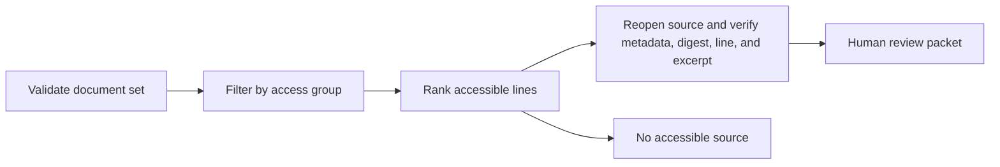

# Source-verified search

A runnable Python example of document search that returns **checkable source lines** for human review. All documents, policies, identifiers, and access groups in this repository are invented. This code was written as a standalone demonstration; it contains no employer or client code, data, prompts, or configuration.

The example deliberately stops before answer generation. A result is a pointer to a current source line, not a claim that an AI answer is correct.

## Run it

Python 3.10 or later is sufficient. There are no third-party packages, cloud services, credentials, or network calls.

```sh
python3 -m unittest discover -s tests -v
python3 grounded_search.py "expense approval limit" --group staff
python3 grounded_search.py "board-only strategy" --group staff
```

The first query returns a `review_required` packet with the source ID, version, line number, exact excerpt, and SHA-256 digest of the current document body. The second returns `no_source_found` because the only matching document is outside the requested group.

## How the boundary works



1. `load_documents` refuses malformed rows, empty fields, invalid access groups, and duplicate source IDs. It does not silently repair bad input.
2. `search` applies the group filter **before** scoring any line. It uses simple term overlap and a stable tie order so the example is easy to inspect.
3. `resolve_result` checks access again when the line is opened. It also checks the source ID, title, version, body digest, line number, and exact excerpt against the current document set. A changed or missing source fails closed.
4. `review_packet` returns only verified excerpts. No match yields `no_source_found`; the code never invents a source or approves a decision.

The tests include denied access, a changed source, changed metadata, a fabricated excerpt, missing and duplicate sources, malformed access groups, and deterministic ranking. Run them locally or see the GitHub Actions test workflow.

## Scope and limits

This is a **local design example**, not a deployed search service. The `--group` argument is user supplied test input, not authentication. SHA-256 detects a changed body when compared with the current file; it does not authenticate who wrote the file or make a trusted audit log. Keyword overlap is not semantic retrieval, and the example has no language model, claim-level answer validator, user management, or production security controls.

The example demonstrates a verifiable citation path and explicit failure behavior. It makes no claim about the performance or implementation of any other project.
