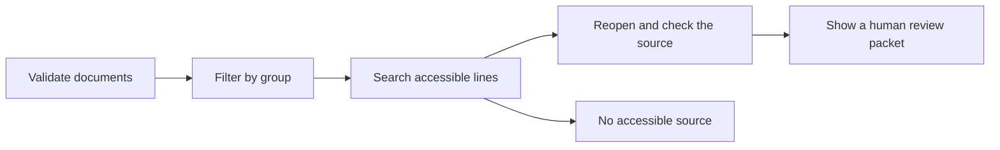

# Search with sources kept visible

This Python demo searches a small set of documents and shows the exact source line behind each result. Every document and policy in the demo is invented. It contains no employer or client code, records, prompts, or configuration.

The point is simple: if a person cannot reopen and check a source, the result should not be used. This demo returns lines for human review. It does not write or approve an answer.

## Try it

Use Python 3.10 or later. No packages, accounts, credentials, or network connection are needed.

```sh
python3 -m unittest discover -s tests -v
python3 grounded_search.py "expense approval limit" --group staff
python3 grounded_search.py "board-only strategy" --group staff
```

The expense query returns a review packet. Each result has a source ID, document version, line number, exact text, and SHA-256 digest. The board query returns `no_source_found` for the `staff` group. It does not reveal the restricted document.

## What the code checks



1. Check the document set first. Empty fields, invalid groups, and duplicate source IDs stop the run.
2. Filter by group before ranking lines. The rank is a simple word overlap with a fixed order for ties.
3. Check access again when opening a result. The source ID, title, version, digest, line number, and excerpt must still match the current document.
4. Stop if the source is missing or changed. If nothing accessible matches, return `no_source_found`. Do not fill the gap with invented text.

The 14 tests cover these checks, including changed sources, forged excerpts, denied access, malformed input, and repeatable ranking. GitHub Actions runs the same tests on each push and pull request.

## What this does not prove

This is a local example, not a deployed service. The `--group` option is supplied by whoever runs the command. It is **not** a login or an access control system for real files. The digest catches a changed document body during this check; it does not prove who wrote the document or create a secure audit trail.

Search uses word overlap, not semantic retrieval. There is no language model or answer checker. The demo shows one way to keep a search result tied to a source. It makes no claim about another project's code, security, or results.
